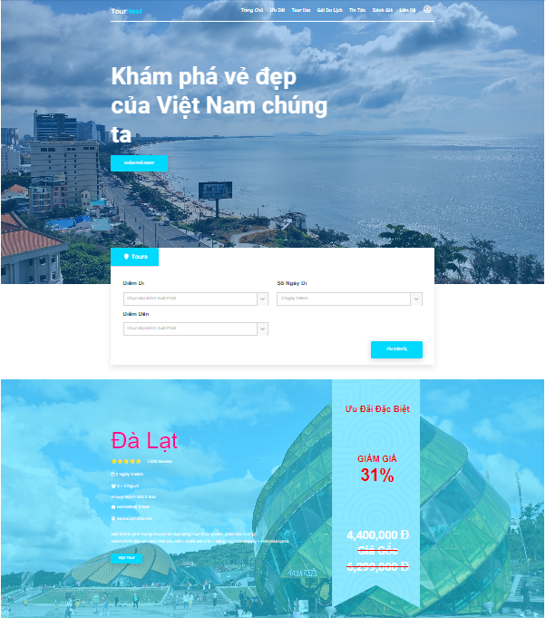
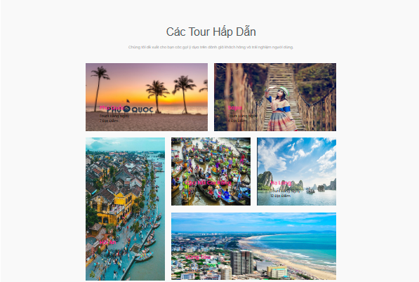
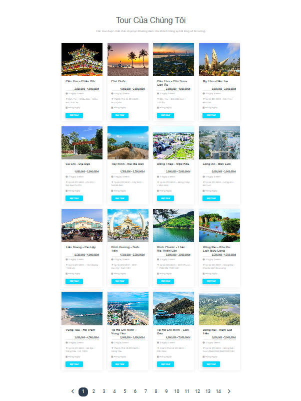
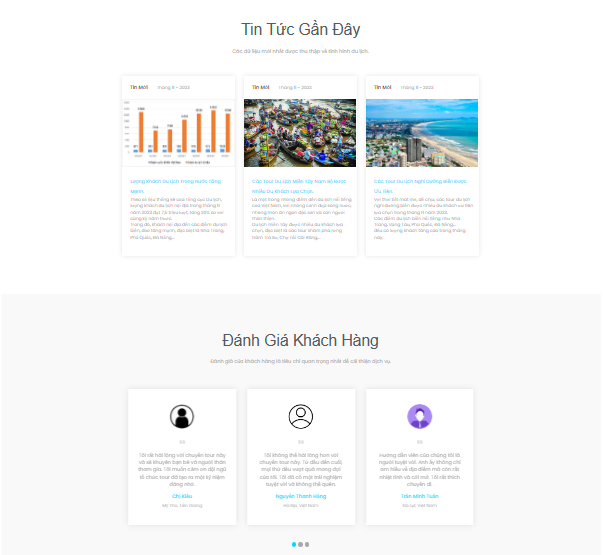
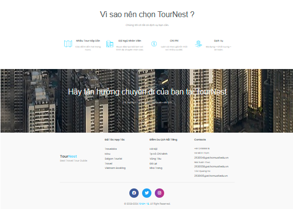

# Tên trang web: TourNest

Trang web TourNest là một trang web du lịch đặc biệt được tạo bởi một nhóm gồm 3 thành viên. Trang web này được thiết kế
và phát triển bằng cách sử dụng HTML5 và các công nghệ web khác.

# Giới thiệu

TourNest là một trang web HTML5 đáng chú ý dành cho các đại lý du lịch và công ty du lịch. Với giao diện đẹp mắt và
bố cục tuyệt vời, trang web mang lại nhiều giá trị cho người dùng. Với màu sắc tươi sáng và giao diện người dùng hấp
dẫn, TourNest mang đến trải nghiệm tuyệt vời cho người dùng. Trang web cung cấp chức năng hộp tìm kiếm đặc biệt cho kế
hoạch du lịch. Điều này giúp người dùng tiện lợi từ kế hoạch du lịch cho đến đặt
khách sạn thông qua việc chọn chuyến bay.

# Mục tiêu chiến lược

Mục tiêu chiến lược của trang web bán tour du lịch là đạt được những mục tiêu chung của doanh nghiệp, bao gồm:

Tăng trưởng doanh thu: Mục tiêu này thể hiện mong muốn của doanh nghiệp về việc tăng doanh thu từ việc bán tour du lịch.

Tăng thị phần: Mục tiêu này thể hiện mong muốn của doanh nghiệp về việc tăng thị phần trong ngành du lịch.

Tăng độ nhận diện thương hiệu: Mục tiêu này thể hiện mong muốn của doanh nghiệp về việc tăng độ nhận biết của thương hiệu đối với khách hàng.

Ngoài ra, trang web bán tour du lịch cũng có thể đặt ra các mục tiêu chiến lược cụ thể hơn, chẳng hạn như:

Phát triển thị trường mới: Mục tiêu này thể hiện mong muốn của doanh nghiệp về việc mở rộng thị trường bán tour du lịch sang các khu vực mới.

Đa dạng hóa sản phẩm và dịch vụ: Mục tiêu này thể hiện mong muốn của doanh nghiệp về việc cung cấp thêm các sản phẩm và dịch vụ du lịch mới, đáp ứng nhu cầu đa dạng của khách hàng.

Nâng cao chất lượng dịch vụ: Mục tiêu này thể hiện mong muốn của doanh nghiệp về việc cung cấp dịch vụ bán tour du lịch chất lượng cao, đáp ứng kỳ vọng của khách hàng.

Để đạt được các mục tiêu chiến lược này, trang web bán tour du lịch cần xây dựng kế hoạch triển khai cụ thể, bao gồm các hoạt động như:

Tiếp thị và quảng cáo: Trang web cần thực hiện các hoạt động tiếp thị và quảng cáo để thu hút khách hàng.

Cải thiện giao diện và nội dung: Trang web cần được cải thiện giao diện và nội dung để mang lại trải nghiệm tốt nhất cho khách hàng.

Tăng cường dịch vụ khách hàng: Trang web cần tăng cường dịch vụ khách hàng để giải đáp thắc mắc và hỗ trợ khách hàng.

Việc xác định và triển khai mục tiêu chiến lược là một bước quan trọng giúp trang web bán tour du lịch đạt được thành công.
# Preview

# Các thành viên

Trang web TourNest đã được tạo ra nhờ sự góp sức của 3 thành viên:

[ Võ Minh Thịnh - 21130549 ]: Giúp thiết kế giao diện trang web và tạo ra các tài nguyên đồ họa hấp dẫn.
(index, catelory, login, register, shopcart, vali, 70 items)

[ Mai Xuân Thức - 21130604 ]: Đảm nhận vai trò phát triển trang web bằng cách sử dụng HTML5 và các công nghệ web khác.
(admin, infor, login, register, 70 items)

[ Trần Quang Vũ - 21130587 ]: Đóng góp ý tưởng và cung cấp kiến thức chuyên môn về ngành du lịch để tạo ra một trang web hữu ích
và hấp dẫn.
(detail, forgetpass, footer, 70 items)

# Cách sử dụng trang web

Để sử dụng trang web TourNest, bạn có thể truy cập vào liên kết
sau: [Liên kết trang web](https://github.com/MinhThinhrine/Do_An_Web)

## Chức năng của trang web

Trang web TourNest cung cấp nhiều chức năng hữu ích để đáp ứng nhu cầu của người dùng. Dưới đây là một số chức năng chính của trang web:

1. Chức năng lọc: Trang web cung cấp chức năng lọc để người dùng có thể tìm kiếm các kế hoạch du lịch, vé máy bay hoặc khách sạn theo các tiêu chí như địa điểm, ngày đi, ngày về, loại hình du lịch, và nhiều yếu tố khác.

2. Chức năng xem ưu đãi và tour hot: Trang web hiển thị danh sách các ưu đãi và tour hot đang được cung cấp. Người dùng có thể xem thông tin chi tiết về từng tour và ưu đãi, bao gồm mô tả, giá cả, điểm đến, và thời gian.

3. Chức năng xem các đánh giá: Trang web cho phép người dùng xem các đánh giá và nhận xét từ những người đã trải nghiệm các tour du lịch trước đó. Điều này giúp người dùng có cái nhìn tổng quan về chất lượng dịch vụ và trải nghiệm của các tour đã được tổ chức.

4. Chức năng đóng góp ý kiến: Trang web cung cấp chức năng cho phép người dùng đóng góp ý kiến và đánh giá về các tour và dịch vụ du lịch mà họ đã trải nghiệm. Điều này giúp cải thiện chất lượng dịch vụ và cung cấp thông tin hữu ích cho những người khác quan tâm đến việc đặt tour.

5. Chức năng xem tin tức: Trang web cung cấp các tin tức và thông tin mới nhất về du lịch, bao gồm các sự kiện, điểm đến mới, hoạt động và xu hướng du lịch. Người dùng có thể cập nhật thông tin và tin tức mới nhất liên quan đến ngành du lịch.

6. Chức năng thêm sản phẩm vào giỏ hàng: Trang web cho phép người dùng thêm các tour, vé máy bay hoặc khách sạn vào giỏ hàng để lựa chọn và đặt hàng sau. Chức năng này giúp người dùng tổ chức và quản lý các sản phẩm du lịch một cách thuận tiện.

7. Chức năng thanh toán: Trang web hỗ trợ chức năng thanh toán trực tuyến để người dùng có thể thanh toán các tour và dịch vụ du lịch một cách an toàn và thuận tiện. Người dùng có thể sử dụng các phương thức thanh toán phổ biến như thẻ tín dụng, chuyển khoản ngân hàng hoặc ví điện tử.

8. Chức năng hủy chuyến đi: Trang web cung cấp chức năng hủy chuyến đi cho người dùng trong trường hợp họ cần hủy tour hoặc thay đổi kế hoạch du lịch. Điều này giúp người dùng có sự linh hoạt trong việc quản lý lịch trình cá nhân.

Với các chức năng trên, TourNest mang đến một trải nghiệm du lịch toàn diện và thuận tiện cho người dùng.

# Góp ý và phản hồi

Chúng tôi rất mong nhận được phản hồi từ bạn về trang web TourNest. Nếu bạn đã sử dụng trang web và muốn chia sẻ với
chúng tôi, vui lòng gửi email đến địa chỉ sau:
[ 21130549@st.hcmuaf.edu.vn ] [ 21130604@st.hcmuaf.edu.vn ] [ 21130587@st.hcmuaf.edu.vn ]. Chúng tôi sẽ viết một bài viết trên blog để giới
thiệu những ví dụ tốt nhất.

# Bản quyền và giấy phép

Trang web TourNest được bảo vệ bởi quyền sở hữu trí tuệ và các quyền sở hữu khác. Hãy đảm bảo tuân thủ các quy định về
bản quyền và giấy phép khi sử dụng trang web này.
